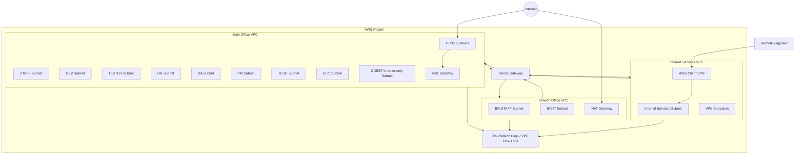

# AWS Enterprise Network Infrastructure

Dự án này chuyển mô hình mạng doanh nghiệp được thiết kế trên Cisco Packet Tracer sang một kiến trúc AWS có thể triển khai tự động bằng Terraform.

Mô hình gốc có các thành phần chính: trụ sở chính, chi nhánh, vùng DC/server, remote VPN, phân đoạn VLAN theo phòng ban, core switch dự phòng, OSPF, NAT, ACL, GRE over IPsec và guest network chỉ được ra Internet. Trên AWS, các khái niệm này được ánh xạ sang VPC, subnet, route table, security group, Transit Gateway, Client VPN, NAT Gateway, VPC Endpoint và CloudWatch/VPC Flow Logs.

> Repository này không chỉ chứa Terraform. Nó là một project hoàn chỉnh gồm IaC, tài liệu kiến trúc, sơ đồ, quy trình triển khai, script vận hành và CI kiểm tra chất lượng mã.

## Architecture Overview



## Packet Tracer to AWS Mapping

| Packet Tracer | AWS Equivalent |
|---|---|
| VLAN 10/20/30/40/50/60/70/80/90 | Department private subnets |
| CoreSW1/CoreSW2 + HSRP | Multi-AZ subnet design + managed AWS availability |
| OSPF between routers/core switches | Transit Gateway route tables + VPC route tables |
| GRE over IPsec site tunnels | Transit Gateway attachments / optional Site-to-Site VPN extension |
| NAT overload on edge routers | NAT Gateway |
| ACL inter-VLAN rules | Security Groups, NACL baseline, subnet-level routing policy |
| Guest VLAN internet-only | Guest subnet with no TGW route and restrictive egress policy |
| Remote VPN router/client | AWS Client VPN |
| DC subnet 192.168.10.0/24 | Shared Services VPC |
| ISP router simulation | AWS Internet Gateway / public Internet |

## Repository Structure

```text
.
├── .github/workflows/          # GitHub Actions CI for Terraform
├── diagrams/                   # Mermaid architecture diagrams
├── docs/                       # Design, deployment, security and operations docs
├── scripts/                    # Helper scripts for init/validate/plan/destroy
├── terraform/
│   ├── environments/
│   │   ├── dev/                # Development environment
│   │   └── prod/               # Production-ready skeleton
│   └── modules/
│       ├── client-vpn/
│       ├── ec2-demo-service/
│       ├── flow-logs/
│       ├── security-groups/
│       ├── transit-gateway/
│       ├── vpc-foundation/
│       ├── vpc-tgw-routes/
│       └── vpc-endpoints/
├── .gitignore
├── .pre-commit-config.yaml
├── Makefile
└── README.md
```

## What This Project Deploys

For the `dev` environment, Terraform creates:

- Main Office VPC with department subnets: STAFF, DEV, TESTER, HR, BA, PM, TECH, CEO and GUEST.
- Branch Office VPC with BR-STAFF and BR-IT subnets.
- Shared Services VPC for internal services, management and private endpoints.
- Transit Gateway to connect Main, Branch and Shared Services networks.
- Per-VPC public subnets, Internet Gateway and optional NAT Gateway.
- Security groups aligned with enterprise segmentation.
- Optional AWS Client VPN endpoint for remote users.
- Optional internal EC2 demo service managed through AWS Systems Manager.
- VPC endpoints for SSM, EC2 Messages, SSM Messages, CloudWatch Logs and S3.
- VPC Flow Logs to CloudWatch Logs.
- GitHub Actions workflow for fmt, validate and Checkov scanning.

## Requirements

- Terraform >= 1.6
- AWS CLI configured with a profile that can create VPC, EC2, TGW, IAM, CloudWatch Logs and Client VPN resources
- An S3 bucket and DynamoDB table for remote state, or use local state while testing
- Optional: Checkov, TFLint, pre-commit

## Quick Start

```bash
cd terraform/environments/dev
cp terraform.tfvars.example terraform.tfvars
terraform init
terraform fmt -recursive
terraform validate
terraform plan
terraform apply
```

Or use the helper commands:

```bash
make init ENV=dev
make validate ENV=dev
make plan ENV=dev
make apply ENV=dev
```

## Remote State

The default `backend.tf` is intentionally commented so the repo can run locally first. For real GitHub usage, create an S3 backend and DynamoDB lock table, then uncomment and update `backend.tf`.

```hcl
backend "s3" {
  bucket         = "your-terraform-state-bucket"
  key            = "aws-enterprise-network/dev/terraform.tfstate"
  region         = "ap-southeast-1"
  dynamodb_table = "terraform-locks"
  encrypt        = true
}
```

## Client VPN

Client VPN is disabled by default because AWS requires valid ACM certificate ARNs. To enable it:

1. Create/import a server certificate into ACM.
2. Create/import a client root certificate into ACM.
3. Set `enable_client_vpn = true` in `terraform.tfvars`.
4. Fill `client_vpn_server_certificate_arn` and `client_vpn_root_certificate_arn`.

## Notes About AWS vs Packet Tracer

AWS is not a layer-2 campus switch environment. It does not use VLAN trunking, HSRP or OSPF inside a VPC. The design therefore preserves the original intent rather than copying CLI commands directly:

- High availability is provided by AWS managed services and multi-AZ design.
- Segmentation is implemented with subnet boundaries, security groups, NACLs and route tables.
- Inter-site routing is centralized by Transit Gateway.
- Remote access is handled by AWS Client VPN.
- Observability is implemented through VPC Flow Logs and CloudWatch.

## Suggested GitHub Push

```bash
git init
git add .
git commit -m "Initial AWS enterprise network infrastructure project"
git branch -M main
git remote add origin https://github.com/<your-username>/aws-enterprise-network.git
git push -u origin main
```

## Security Warning

Do not commit AWS access keys, Terraform state files, `.tfvars` files containing secrets, VPN certificates, SSH private keys or generated client VPN profiles.
